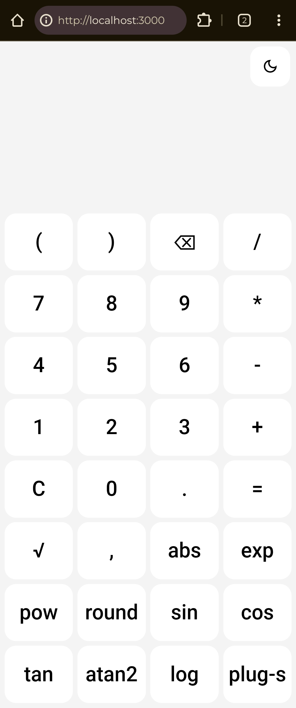
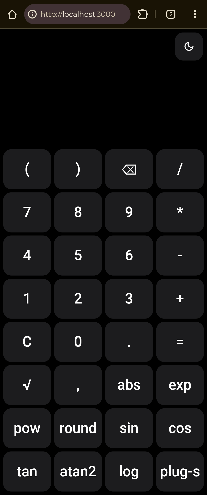
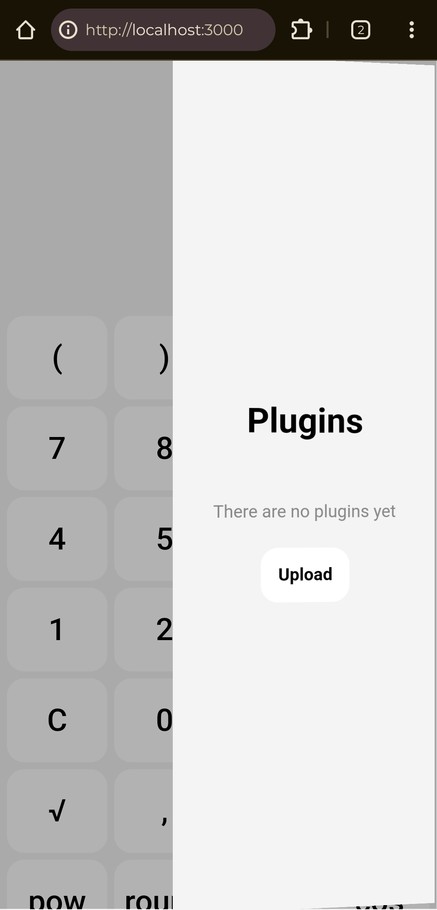
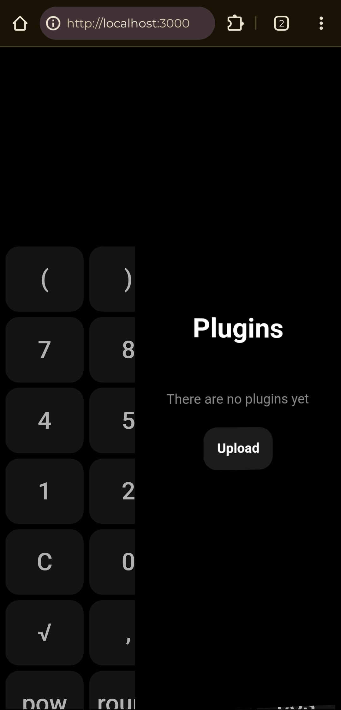

# Calculator

A lightweight, extensible calculator built with pure **HTML**, **CSS**, and **JavaScript**.
It supports a plugin system for customization and new functionality, includes light and dark themes, and runs entirely in the browser without external frameworks.

---

## Features

- 🧮 Standard and advanced mathematical operations
- 🌙 Light and dark theme toggle
- 🔌 Plugin system for extending functionality
- 📂 Upload custom JavaScript plugins directly from the interface
- 💾 Plugins persisted via `localStorage`
- 📱 Responsive layout suitable for desktop and mobile

---

## Screenshots

| Light mode | Dark mode |
|-------------|-------------|
|  |  |

| Light mode plugins | Dark mode plugins |
|-------------|-------------|
|  |  |

---

## Live Demo

You can use the calculator directly in your browser:

👉 https://VaheeMand.github.io/Calculator/

---

## Installation and Local Usage

### Option 1: Clone and Run Locally

Clone the repository:

```
git clone https://github.com/VaheeMand/Calculator.git
cd Calculator
```

#### Using `live-server` (Node.js)

Install and run:

```
npm install -g live-server
live-server
```

Then open the provided local URL in your browser.

#### Using Python

```
python -m http.server
```

Open:

```
http://localhost:8000
```

in your browser.

---

### Option 2: Use the Hosted Version

Simply visit:

https://VaheeMand.github.io/Calculator/

No installation required.

---

## Plugin System

The calculator includes a built-in plugin loader that allows executing custom JavaScript code at runtime.

### Capabilities

- Add new buttons or UI elements
- Extend mathematical operations
- Modify calculator behavior
- Access the DOM and internal logic

Plugins are stored in `localStorage` and executed automatically on startup.

---

### 

---

### Uploading a Plugin

1. Open the Plugins menu using the `plug-s` button.
2. Click **Upload**.
3. Select a `.js` file.
4. The plugin will be added and executed automatically.
5. Plugins can be removed from the same menu.

---

## Themes

The application supports:

- **Light theme** (default)
- **Dark theme**

Switch themes using the button in the top-right corner.
Themes are implemented using CSS variables and a `.dark` class on the root element.

---

## Security Notice

Plugins are executed using `new Function()` and therefore have full access to the page context.
Only install plugins from sources you trust.

---

## License

MIT.
