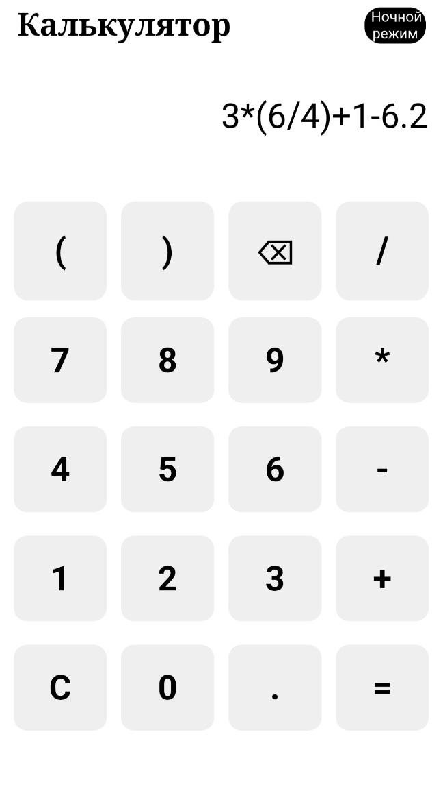
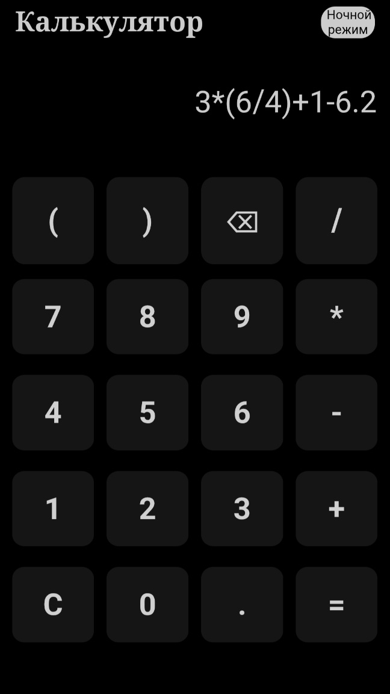

# Simple Calculator

A basic calculator built with HTML, CSS, and JavaScript.  
Performs addition, subtraction, multiplication, and division.  
Includes a **dark mode** toggle.

> ⚠️ Warning: You can type JavaScript code directly into the calculator input and press `=` to execute it.  
> This allows extra math operations, modifying the page, loading libraries, etc. Use responsibly.

## Screenshots

| White Mode | Black Mode |
|------------|------------|
|  |  |

## How to use

Just open `index.html` in your browser and start calculating.  
Use the toggle to switch between light and dark mode.

## License

MIT
